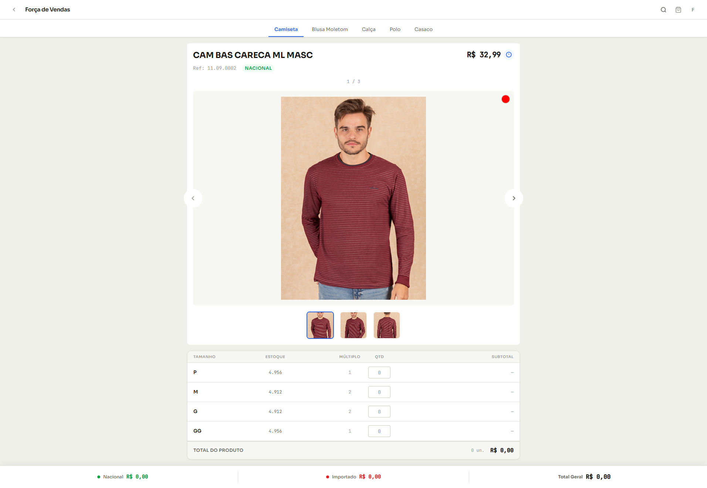

<h1 align="center">
  E-Catalogos (Teste Front End)
</h1>

<p align="center">
  Projeto desenvolvido como parte do teste técnico para a vaga de Front-End Júnior na E-Catalogos, focado na criação de um fluxo de e-commerce moderno e responsivo.
</p>

<p align="center">
  
</p>

## 🎯 Objetivo do Projeto

O desafio consistiu em desenvolver uma vitrine de produtos funcional, integrando um sistema de carrinho de compras e visualização detalhada via modal, seguindo os padrões de design e requisitos técnicos da empresa.

## 🛠️ Tecnologias Utilizadas

- **React**: Biblioteca base para construção da interface.
- **TypeScript**: Garantia de tipagem estática e maior segurança no desenvolvimento.
- **Vite**: Ferramenta de build rápida para o ecossistema React.
- **Redux**: Gerenciamento de estado global (Carrinho e Lista de Produtos).
- **CSS-in-JS / Styled Components**: (Ajuste aqui conforme sua escolha de estilização).

## ⚙️ Funcionalidades Implementadas

Conforme solicitado nos requisitos obrigatórios:

### 🛍️ Vitrine de Produtos (Slider)
- Listagem dinâmica de produtos consumidos via JSON.
- Implementação de **Slider/Carrossel** para navegação entre os itens.
- Exibição de informações essenciais: Nome, Preço Original, Preço com Desconto e Identificador (Nacional/Importado).

### 🛒 Gerenciamento de Carrinho (Sidebar)
- Adição e remoção de itens ao carrinho em tempo real.
- Controle de quantidade (Aumentar/Diminuir) diretamente na sidebar.
- Cálculo automático do valor total da compra.
- Estado persistente ou reativo via Redux.

### 🖼️ Modal de Detalhes
- Abertura de modal ao clicar no botão de compra ou no produto.
- Exibição de detalhes do produto: Imagem ampliada, variações de cores/tamanhos e descrição.

### 📱 Design Responsivo
- Interface adaptável para dispositivos móveis e desktop, seguindo a referência visual fornecida.

<br>

# 🛠️ Instalação e Execução

### Requisitos
- Node.js (versão 14 ou superior)
- npm ou yarn

### Passos
1. **Clone o repositório:**
```sh
git clone [https://github.com/RodrigoRodrigues-Dev/teste-front-end.git](https://github.com/RodrigoRodrigues-Dev/teste-front-end.git)

cd teste-front-end
```

2. **Instale as dependências:**

```sh
npm install
```

3. **Inicie a aplicação:**

```sh
npm run dev
```

### Autor
Rodrigo Rodrigues
